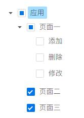

# Angular+Ng Alain实现权限配置，树形子节点未选时保留父节点半全选
在项目开发中有特殊需求，因为用到Ng Alain的树形选择做权限配置，所以要求子节点未选时保留父节点半全选，实现按钮不可用的情况下，不影响页面访问：



```html
<nz-spin [nzTip]="'正在读取数据...'" [nzSpinning]="service.http.loading">
  <nz-tree
    #nzTree
    [nzSelectedKeys]="defaultSelectedKeys"
    [nzExpandedKeys]="defaultExpandedKeys"
    [(nzData)]="nzRoleMenuTreeNodels"
    [nzCheckedKeys]="defaultCheckedKeys"
    nzCheckable="true"
    (nzClick)="nzTreeEvent($event)"
    (nzCheckBoxChange)="nzTreeCheck($event)"
  >
  </nz-tree>
</nz-spin>
<button
  nz-button
  [nzType]="'primary'"
  (click)="submit()"
  [disabled]="service.http.loading"
>
保存
</button>
```

```ts
import { Component, OnInit, ViewChild } from '@angular/core';
import {
  NzModalRef,
  NzMessageService,
  NzTreeComponent,
  NzFormatEmitEvent,
} from 'ng-zorro-antd';

import { AuthoritySetService } from '../../authority-set.service';

@Component({
  templateUrl: 'set-menu.component.html',
})
export class SetRoleMenuComponent implements OnInit {
  @ViewChild('nzTree') nzTree: NzTreeComponent;
  // 角色ID
  roleId: string;

  // 默认选中的key值
  defaultCheckedKeys = [];
  // 菜单数据
  nzRoleMenuTreeNodels = [];

  // 默认选中节点
  defaultSelectedKeys = [];
  // 默认展开的节点
  defaultExpandedKeys = [];
  // 已勾选的节点
  checkedNode = [];

  constructor(
    public service: AuthoritySetService,
    private modal: NzModalRef,
    private message: NzMessageService,
  ) {}

  ngOnInit() {
    this.getMenuTree();
  }

  // 获取菜单树形数据
  getMenuTree() {
    this.service.getMenuTreeByRole(this.roleId).subscribe((res: any) => {
      this.defaultCheckedKeys = res.defaultCheckedKeys;
      this.nzRoleMenuTreeNodels = res.nzRoleMenuTreeNodels;

      // 处理半全选状态
      setTimeout(() => {
        this.formatTree(this.nzTree.nzNodes);
      }, 100);

      // 默认展开第一级
      if (
        this.nzRoleMenuTreeNodels &&
        this.nzRoleMenuTreeNodels[0].children
      ) {
        this.defaultSelectedKeys = this.nzRoleMenuTreeNodels[0].key;
        this.defaultExpandedKeys = this.nzRoleMenuTreeNodels[0].key;
      }
    });
  }

  // 格式化树形数据
  formatTree(data) {
    if (!data) {
      return null;
    }

    data.forEach(e => {
      // console.log(e.origin.title, e.isChecked, e.origin.isChecked);

      // 只能通过子节点来设置父节点的半选择状态
      if (e.parentNode) {
        if (e.parentNode.origin.isChecked == true || e.parentNode.origin.isHalfChecked == true) {
          e.setSyncChecked(e.origin.isChecked, true);
        }
      }
      // 递归
      if (e.children.length > 0) {
        this.formatTree(e.children);
      }
    });

    return data;
  }

  // 树形点击/展开事件
  nzTreeEvent(event: Required<NzFormatEmitEvent>): void {
    const eventName = event.eventName;
    const node = event.node;

    // 禁止操作
    if (node.isDisabled) return;

    // 点击事件
    // tslint:disable-next-line: triple-equals
    if (eventName == 'click' && node.isLeaf == false) {
      node.isExpanded = true;
    }
  }

  // 树节点勾选事件
  nzTreeCheck(event: Required<NzFormatEmitEvent>): void {
    // 当前节点
    const node = event.node;
    // 父级节点
    const parentNode = node.parentNode;

    if (parentNode) {
      const checkedChildrens = parentNode.children.filter(
        e => e.isChecked === true,
      );

      if (!checkedChildrens.length && node.origin.isButton) {
        // 父级节点半选中
        node.setSyncChecked(node.isChecked, true);
      }
    }
  }

  // 提交保存
  submit() {
    this.checkedNode = [];
    const allNode = this.nzTree.getTreeNodes();

    allNode.forEach(element => {
      this.formatData(element);
    });

    this.service.setRoleMenu(this.roleId, this.checkedNode).subscribe((res: any) => {
        if (res.result === 0) {
          this.message.success(res.message);
          this.close(true);
        } else {
          this.message.error(res.message);
        }
      });
  }

  // 格式化数据
  formatData(node) {
    if (node.isHalfChecked || node.isChecked) {
      this.checkedNode.push({ id: node.key, isbutton: node.origin.isButton });
    }

    node.children.forEach(element => {
      this.formatData(element);
    });
  }

  close(opt) {
    this.modal.destroy(opt);
  }
}

```