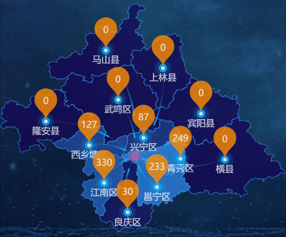

# ECharts在地图上显示数值增量动画
<!-- 在项目开发中需要在EChart地图上背景图片需要用到动图展示，但是EChart只能显示gif的第一帧，最后决定改用echarts画渐变背景色块，并使用setInterval让它匀速运动： -->



```html
<template>
  <div>
    <!-- eslint-disable -->
    <div :ref="className" :class="className" :style="{ height, width }"></div>
  </div>
</template>
```

```js
import echarts from "echarts";
require("echarts/theme/macarons"); // echarts theme
import resize from "mixins/chart/resize";
import { deepClone } from "utils";
import geoJson from "mock/nanning.json";
import { clearTimer } from "utils";

export default {
  name: "StatisticsMsgMap",
  mixins: [resize],
  props: {
    // 图表名称
    title: {
      type: String,
      default: ""
    },
    // 地理坐标数据
    geoCoordMap: {
      type: Object,
      default: () => ({
        南宁市: [108.467414, 23.055856]
      })
    },
    // 图表数据
    chartData: {
      type: Array,
      default: () => []
    },
    // 中心点
    centerPoint: {
      type: Array,
      default: () => [
        {
          name: "红色中心点",
          value: [108.417414, 22.815856]
        }
      ]
    },
    // 弹窗消息
    popupMsg: {
      type: Array,
      default: () => [
        {
          // action: "办理",
          // actionTime: "2019-11-15T16:46:30.2626147+08:00",
          // actionTimeStr: "2019年11月15日 04:46:30",
          // cityCode: "4501",
          // cityName: "桂林市",
          // businessName: "业务",
          // latitude: 23.055856,
          // longitude: 108.467414,
          // operator: "林勇",
          // increment: 5
        }
      ]
    },
    // 坐标轴数值配置
    axis: {
      type: Object,
      default: () => ({
        name: "系统名称",
        property: "name"
      })
    },
    // 条形数值配置
    series: {
      type: Array,
      default: () => [
        {
          name: "登录次数",
          property: "loginTime"
        }
      ]
    },
    // 颜色列表
    colorList: {
      type: Array,
      default: () => [
        "rgba(254,174,33,.9)",
        "rgba(255,57,121,.9)",
        "rgba(8,186,236,.9)"
      ]
    },
    // 是否排序
    sort: {
      type: Boolean,
      default: false
    },
    // 图表背景
    background: {
      type: String,
      default: "transparent"
    },
    // 字体基数
    scale: {
      type: Number,
      default: 1
    },
    // 类名
    className: {
      type: String,
      default: "chart"
    },
    // 宽度
    width: {
      type: String,
      default: "100%"
    },
    // 高度
    height: {
      type: String,
      default: "300px"
    }
  },
  watch: {
    popupMsg(data) {
      if (this.popupMsg.length) {
        this.getMsg();
      } else {
        this.initChart();
      }
    }
  },
  data() {
    return {
      chart: null,
      option: {},
      popupMsgClear: false,
      // 延时器
      msgCanvasTimer: null,
      // test
      testTimer: null,
      // 消息背景（加血特效）
      msgBg: require("@/assets/screen_images/img_msg_bg.png")
    };
  },
  mounted() {
    this.$nextTick(() => {
      echarts.registerMap("nanning", geoJson);
      if (this.$refs[this.className]) {
        this.chart = echarts.init(this.$refs[this.className]);
        this.initChart();
      }
    });
  },
  beforeDestroy() {
    if (!this.chart) {
      return;
    }
    this.chart.dispose();
    this.chart = null;

    clearTimer([this.msgCanvasTimer, this.testTimer]);
  },
  methods: {
    initChart() {
      let coordinateData = [],
        lineData = [];
      for (let name in this.geoCoordMap) {
        coordinateData.push({
          name,
          value: this.geoCoordMap[name]
        });

        lineData.push([
          { coord: this.geoCoordMap[name] },
          { coord: this.centerPoint[0].value }
        ]);
      }

      this.option = {
        backgroundColor: this.background,
        grid: {
          left: 0,
          right: 0,
          bottom: 0,
          top: "12%"
        },
        // 地图选取控件
        visualMap: {
          show: false,
          min: 0,
          max: 500,
          left: "left",
          top: "bottom",
          text: ["高", "低"], // 文本，默认为数值文本
          calculable: true,
          seriesIndex: [0],
          inRange: {
            color: [
              "rgba(21, 4, 87, 0.7)",
              // "rgba(137, 104, 255, 0.7)",
              "rgba(47, 148, 255, 0.7)",
              "rgba(21, 4, 87, 0.7)"
            ]
          }
        },
        // 地图
        geo: {
          map: "nanning",
          label: {
            show: false,
            emphasis: {
              show: false
            }
          },
          // 地图变形，1为不变形
          aspectScale: 1,
          // 缩放操作
          // roam: true,
          // 地图样式
          itemStyle: {
            normal: {
              areaColor: "#04235b",
              borderColor: "#47a5fc"
            },
            emphasis: {
              areaColor: "rgba(0,0,0, 0.35)"
            }
          }
        },
        series: [
          // 地图样式，配合控件使用
          {
            type: "map",
            map: "nanning",
            geoIndex: 0,
            aspectScale: 1, //长宽比
            label: {
              normal: {
                show: false
              },
              emphasis: {
                show: false,
                textStyle: {
                  color: "#abf6fc"
                }
              }
            },
            roam: true,
            itemStyle: {
              normal: {
                areaColor: "#04235b",
                borderColor: "#47a5fc"
              },
              emphasis: {
                areaColor: "rgba(0,0,0, 0.35)"
              }
            },
            animation: false,
            data: this.chartData
          },
          // 涟漪坐标点
          {
            type: "effectScatter",
            coordinateSystem: "geo",
            z: 1,
            data: coordinateData,
            showEffectOn: "render",
            rippleEffect: {
              brushType: "stroke"
            },
            symbolSize: 10 * this.scale,
            // symbolSize: val => {
            //   let size = 10;

            //   const keys = Object.keys(this.popupMsg);
            //   // 非空对象
            //   if (keys.length) {
            //     if (
            //       val[1] === this.popupMsg.latitude &&
            //       val[0] === this.popupMsg.longitude
            //     ) {
            //       size = 20;
            //     }
            //   }
            //   return size * this.scale;
            // },
            label: {
              normal: {
                show: false
              }
            },
            itemStyle: {
              color: "rgba(4, 191, 255, 0.75)"
            }
          },
          // 涟漪坐标点-中心点
          {
            type: "effectScatter",
            coordinateSystem: "geo",
            z: 1,
            data: this.centerPoint,
            showEffectOn: "render",
            rippleEffect: {
              brushType: "stroke"
            },
            symbolSize: 10 * this.scale,
            label: {
              normal: {
                show: false
              }
            },
            itemStyle: {
              color: "rgb(255, 41, 140, 0.75)"
            }
          },
          // 坐标点
          {
            type: "scatter",
            coordinateSystem: "geo",
            z: 10,
            data: coordinateData,
            symbolSize: 5 * this.scale,
            label: {
              normal: {
                show: true,
                position: "bottom",
                formatter: "{b}"
              }
            },
            itemStyle: {
              color: "#fff"
            }
          },
          // 数值点
          {
            name: "点",
            type: "scatter",
            coordinateSystem: "geo",
            symbol: "pin",
            symbolSize: 50 * this.scale,
            // symbolSize: val => {
            //   let size = 50;

            //   // 非空对象
            //   if (this.popupMsg.length) {
            //     for(let i = 0; i < this.popupMsg.length; i ++){
            //       if(val[1] === this.popupMsg[i].value[0] && val[0] === this.popupMsg[i].value[1]){
            //         size = 80;
            //         break;
            //       }
            //     }
            //   }
            //   return size * this.scale;
            // },
            label: {
              normal: {
                show: true,
                formatter: val => {
                  const data = val.data.value[2];
                  return data;
                },
                textStyle: {
                  color: "#fff",
                  fontSize: 12 * this.scale
                }
              }
            },
            itemStyle: {
              normal: {
                color: "#ff8d00" //标志颜色
              }
            },
            zlevel: 10,
            data: this.convertData(this.chartData)
          },
          //地图线的动画
          {
            type: "lines",
            zlevel: 1,
            effect: {
              show: true,
              period: 3 * this.scale,
              trailLength: 0.7,
              color: "rgba(4, 191, 255, 0.75)",
              symbolSize: 2 * this.scale
            },
            lineStyle: {
              normal: {
                color: "#3ed4ff",
                width: 0,
                curveness: 0.2
              }
            },
            animationDelayUpdate: 5000,
            data: lineData
          },
          // 数字累加特效
          {
            type: "effectScatter",
            coordinateSystem: "geo",
            z: 999,
            data: [],
            symbolSize: 1 * this.scale,
            label: {
              normal: {
                show: true,
                // opacity : 0.5,
                formatter: function(params) {
                  return `{tline|+${params.data.value[2]}}`;
                },
                position: "top",
                backgroundColor: {
                  image: this.msgBg
                },
                padding: [35 * this.scale, 0, 60 * this.scale, 0],
                rich: {
                  tline: {
                    padding: [0, 8 * this.scale, 0, 8 * this.scale],
                    color: "#ffe773",
                    fontSize: 14 * this.scale
                  }
                }
              },
              emphasis: {
                show: true
              }
            },
            itemStyle: {
              normal: {
                opacity: 0
              }
            }
          }
        ]
      };

      this.chart.setOption(this.option, true);
    },
    getMsg() {
      console.log("获取到信息：", this.popupMsg);

      clearTimer([this.testTimer]);

      const seriesLen = this.option.series.length;

      if (!this.popupMsg.length) {
        this.popupMsgClear = true;
        this.initChart();
        return;
      }

      if (this.chart) {
        this.popupMsgClear = false;
        this.option.series[seriesLen - 1].data = this.popupMsg;

        let y = 0, opacity = 1;
        this.testTimer = setInterval(() => {
          y += 5;

          // js做小数计算精度有误
          if(opacity <= 0.3){
            clearInterval(this.testTimer);
            this.testTimer = null;
            this.popupMsgClear = true;
            this.initChart();
            return;
          }

          if(y <= 45) {
            this.option.series[seriesLen - 1].itemStyle.normal.opacity = 1;
            this.option.series[seriesLen - 1].label.normal.padding = [35 * this.scale, 0, y * this.scale, 0];
          }

          if (y >= 95) {            
            opacity -= 0.2;
            this.option.series[seriesLen - 1].itemStyle.normal.opacity = opacity;
          }
          // this.initChart();
          this.chart.setOption(this.option, true);
        }, 100);
      }

      // 返回当前消息
      this.$emit("msg-popup", this.popupMsg);
    },
    // 转换数据
    convertData(data) {
      var res = [];
      for (var i = 0; i < data.length; i++) {
        var geoCoord = this.geoCoordMap[data[i].name];
        if (geoCoord) {
          res.push({
            name: data[i].name,
            value: geoCoord.concat(data[i].value)
          });
        }
      }
      return res;
    }
  }
};
```