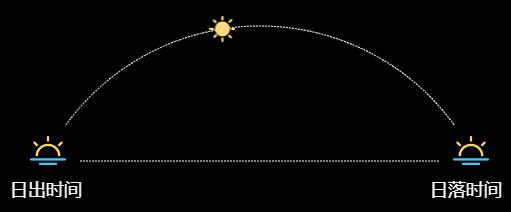

# Angular+Canvas实现日出日落效果
根据当前时刻显示日出日落效果，效果图如下：



```html
<canvas id="sunView" class="sun" width="560" height="210"></canvas>
```

```ts
import { Component, OnInit } from '@angular/core';

@Component({
  selector: 'monitor-screen-environment-monitor',
  templateUrl: './environment-monitor.component.html',
  styleUrls: [`./environment-monitor.component.less`],
})
export class EnvironmentMonitorComponent implements OnInit {
  // 太阳图标坐标
  sunIconCoord = { x: 0, y: 0 };
  // 轨迹圆心坐标
  circleCentreCoord = { x: 280, y: 260 };
  // 轨迹半径
  radius = 240;
  // 初始位置与水平线角度
  initialAngle = Math.PI / 5;

  constructor() {}

  ngOnInit(): void {}

  ngAfterViewInit() {
    this.initSunView();
    this.initTimeLine();
  }

  // 初始化时刻表
  initTimeLine(){
    let date = new Date();
    let hour = date.getHours(); // 当前时刻

    if (hour > 18) hour = 18;
    else if (hour < 6) hour = 6;
    
    let sunriseHour = 6; // 日出时刻
    let sunsetHour = 18; // 日落
    let division = sunsetHour - sunriseHour; // 分等分
    let eachAngle = (Math.PI - this.initialAngle * 2) / division; // 每等分角度： 3Π/5*1/12 = Π/20
    let alpha = this.initialAngle + (hour - 6) * eachAngle; // 当前位置角度： (1/5 + n/20)*Π

    // 参考公式：圆心为(a,b)的圆上某点的坐标为 (a+R*cosα, b+R*sinα)，canvas上取物体左上角坐标，要获取真实定位x和y要各自减去长宽的一半
    this.sunIconCoord.x = this.circleCentreCoord.x - this.radius * Math.cos(alpha) - 13;
    this.sunIconCoord.y = this.circleCentreCoord.y - this.radius * Math.sin(alpha) - 13;
  }

  // 初始化日出日落视图
  initSunView() {
    let canvas = <HTMLCanvasElement>document.getElementById('sunView');
    if (canvas.getContext) {
      let ctx = canvas.getContext('2d');

      // 绘制半圆
      ctx.beginPath();
      let startAngle = Math.PI + this.initialAngle; // 开始点
      let endAngle = 2 * Math.PI - this.initialAngle; // 结束点
      let anticlockwise = false; // 顺时针，从右侧开始
      ctx.strokeStyle = '#fff'; // 描边样式
      ctx.setLineDash([2, 1]); // 绘制虚线
      ctx.arc(this.circleCentreCoord.x, this.circleCentreCoord.y, this.radius, startAngle, endAngle, anticlockwise); // 画圆
      ctx.stroke(); // 描边

      // 绘制直线
      ctx.beginPath();
      ctx.setLineDash([2, 1]);
      ctx.moveTo(100, 155);
      ctx.lineTo(460, 155);
      ctx.stroke();

      // 日出/日落对象
      let sunriseImg = new Image();
      sunriseImg.src = './assets/img/monitor-screen/img_sunrise.png';
      sunriseImg.onload = () => {
        ctx.drawImage(sunriseImg, 50, 130);
        ctx.fillStyle = '#fff';
        ctx.font = '18px 微软雅黑';
        ctx.fillText('日出时间', 30, 190);

        ctx.drawImage(sunriseImg, 473, 130);
        ctx.fillStyle = '#fff';
        ctx.font = '18px 微软雅黑';
        ctx.fillText('日落时间', 450, 190);
      };

      // 太阳对象
      let sunImg = new Image();
      sunImg.src = './assets/img/monitor-screen/img_sun.png';
      sunImg.onload = () => {
        // 设置当前时间
        ctx.drawImage(sunImg, this.sunIconCoord.x, this.sunIconCoord.y);
      };
    }
  }
}

```
