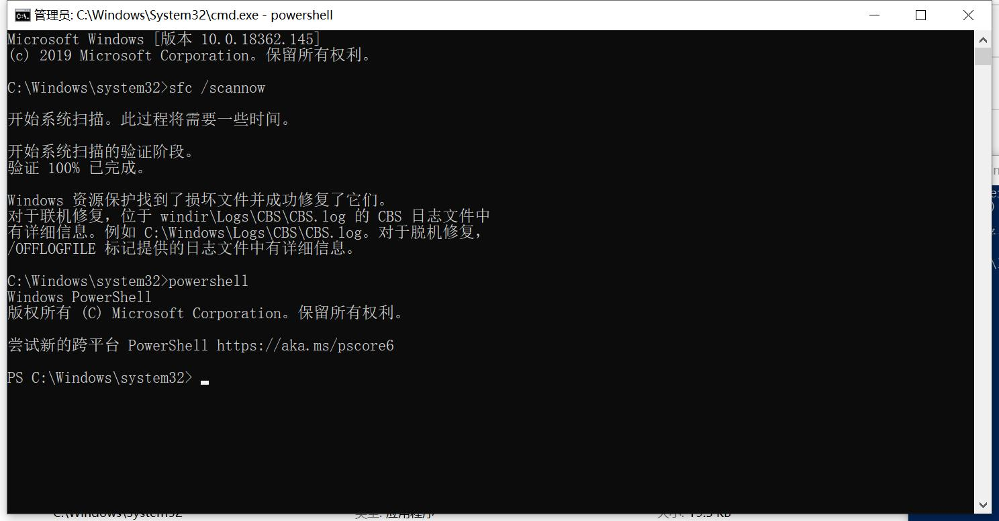

# #.日常项目开发遇到的问题及解决方法

作者：罗永梅
时间：2022 年 08 月 14 日

### 一、管理后台开发，侧边栏固定在左边，并且与页面高度保持一致

以前都是通过浏览器响应事件获取页面高度再使用style="height: mmm px;"设置，现在提供CSS解决方法： 
```css
.sider {
    width: 250px; // 侧边栏高度
    position: fixed; // 固定定位
    top: 0;
    bottom: 0;
    margin-top: 64px; // 页面顶部菜单栏高度
    background: #fff;
    border-right: 1px solid #efe3e5;
}
```
### 二、Windows Powershell打不开或者闪退，导致Vscode无法启动项目，并提示“VSCode启动终端报错：终端进程启动失败：shell可执行文件“C:Windowssystem32and.exe；路径不存在”。
在cmd中输入powershell，提示“'powershell' 不是内部或外部命令,也不是可运行的程序 或批处理文件。”，环境变量都有在，但是就是无法打开Windows Powershell。

解决方案：
以管理员运行cmd，粘贴输入sfc /scannow命令，进行修复操作:



### 三、Node 环境升级后和 node-sass 版本不兼容，项目启动报错“Error: Node Sass version 6.0.1 is incompatible with ^4.0.0.”
因为电脑配置的node环境和vue版本升级，导致原来使用Vue2开发的项目node-sass版本不兼容，但是又因为多项目需要无法对Node多降版本处理，提供以下解决方案：
1. 删除原来的node_modules依赖包
2. 修改package.json：
```json
 "node-sass": "npm:dart-sass@^1.25.0", // 改成dart-sass
```
3. 重新npm install
4. 运行项目后，如果项目中有使用 /deep/ 会报错 “ Expected selector. /deep/ ......”，将 /deep/ 批量替换成 ::v-deep 即可：
```css
.a{
    
    /* /deep/ .el-tree-node {
      padding: 2px 0;
    } */

    ::v-deep .el-tree-node {
      padding: 2px 0;
    }
}
```

### 四、创建vite项目时，报错 “npm ERR! Could not install from “Files\nodejs\node_cache\_npx\10184“ as it does not contain a packag”
因为node路径带有空格，执行以下命令：

> npm config get cache

得到 D:\Program Files\nodejs\node_modules\npm\node_cache，是Program Files 之间有空格。

解决方案，执行以下命令：

> npm config edit

编辑配置文件，将 Program Files 改成 Program~Files，以~代替空格是window支持的一种写法。更改之后就可以正常创建项目了。

### 五、运行 vite3.0+ 项目时，报错 “error when starting dev server:Error: Cannot find module 'node:path'”
vite3.0+ 发现使用 node 模块 path 会报错，升级 node 到 16.0+ 就行了