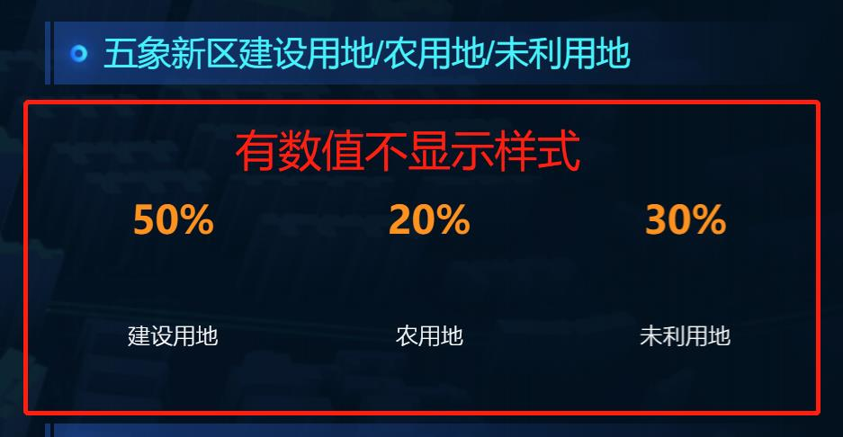
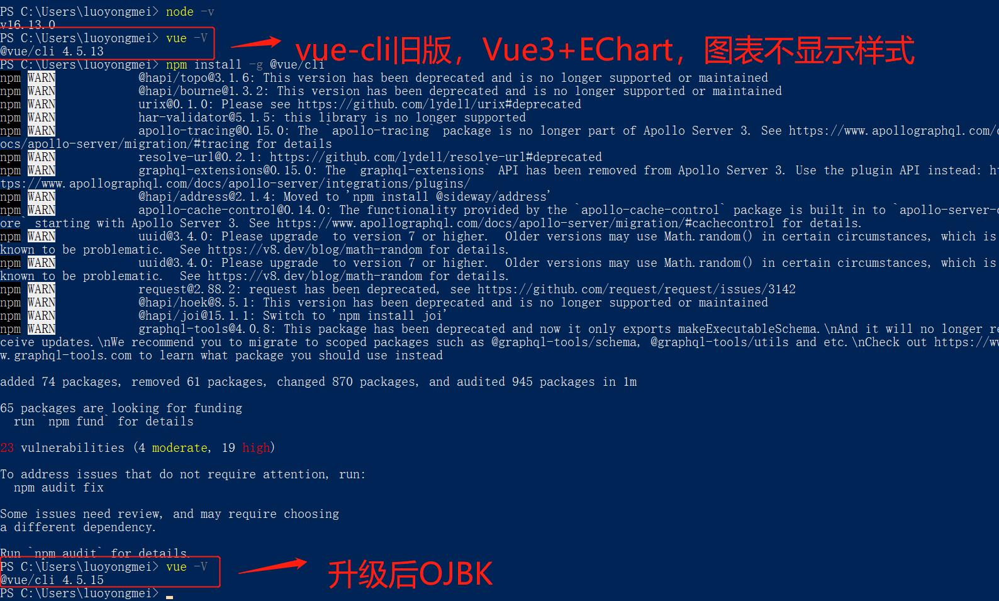
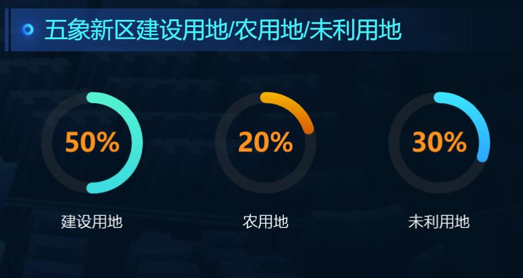

# #.日常项目开发遇到的问题及解决方法

作者：罗永梅
时间：2021 年 11 月 03 日

### 一、管理后台开发，侧边栏固定在左边，并且与页面高度保持一致

以前都是通过浏览器响应事件获取页面高度再使用style="height: mmm px;"设置，现在提供CSS解决方法： 
```css
.sider {
    width: 250px; // 侧边栏高度
    position: fixed; // 固定定位
    top: 0;
    bottom: 0;
    margin-top: 64px; // 页面顶部菜单栏高度
    background: #fff;
    border-right: 1px solid #efe3e5;
}
```
### 二、Windows Powershell打不开或者闪退，导致Vscode无法启动项目，并提示“VSCode启动终端报错：终端进程启动失败：shell可执行文件“C:Windowssystem32and.exe；路径不存在”。
在cmd中输入powershell，提示“'powershell' 不是内部或外部命令,也不是可运行的程序 或批处理文件。”，环境变量都有在，但是就是无法打开Windows Powershell。

解决方案：
以管理员运行cmd，粘贴输入sfc /scannow命令，进行修复操作:


### 三、Vue3 + Echart5.x，饼图图表不显示样式
问题如下：


解决方案：
升级vue-cli版本


升级后显示：
