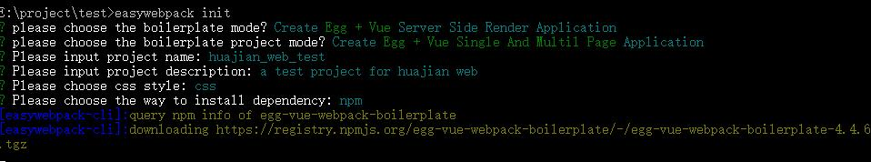

# 9.基于 Egg + Vue + Webpack 服务端渲染开发企业网站，踩坑及解决方法

作者：罗永梅  
时间：2019年02月14日

Egg.js官方文档地址：https://eggjs.org/zh-cn/intro/index.html

### 一、安装egg

egg 需要 Node.js 8.x以上版本。  

在终端输入以下命令全局安装egg:  
> npm i egg-init -g 

安装手脚架： 
> npm install easywebpack-cli -g  

命令行运行：  
> easywebpack init  

选择 egg+vue server side render boilerplate 初始化骨架项目:



<!-- ### 六、安装egg-sequelize插件
sequelize 是 Node.js 社区比较流行的一个 ORM 框架
官方相关文档：http://docs.sequelizejs.com/
中文API文档：https://itbilu.com/nodejs/npm/VkYIaRPz-.html

安装sequelize模块：  
> npm install --save egg-sequelize

安装sqlite驱动模块：  
> npm install --save sqlite3  

在 config/plugin.js 中引入 egg-sequelize 插件：
```
exports.sequelize = {
  enable: true,
  package: 'egg-sequelize',
};
```

在config/config.default.js中编写 sequelize 配置：
```
config.sequelize = {
  dialect: 'sqlite',
  host: '127.0.0.1',
  port: 3306,
  // 仅 SQLite 适用
  storage: 'path/to/database.sqlite'
};
``` -->
