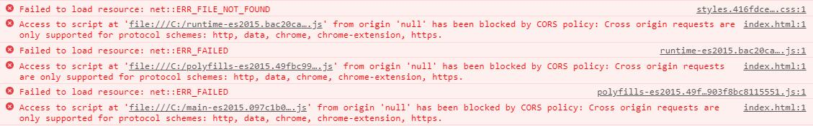

# 初学Angular + Ng Alain + G2，踩坑及解决方法

作者：罗永梅
时间：2019 年 06 月 12 日

### 一、Angular *ngFor 获取 index

普通遍历用法：
```html
<ul>
　　<li *ngFor="let item in items">{{item}}</li>
</ul>
```
有时候需要获取index，可以这样用：
```html
<ul>
    <li *ngFor="let item of items; let i = index">     
       {{ item }} 的索引是：{{ i }}
    </li>
</ul>
```

### 二、Angular *ngIf 和 else 的用法

```html
<div *ngIf="condition; else elseBlock">...</div>
<ng-template #elseBlock>...</ng-template>
```

实例：
```html
<span *ngIf="customPrevIcon === 'default'; else SetIcon1" class="ant-tabs-tab-prev-icon">
    <i nz-icon [type]="nzPositionMode === 'horizontal' ? 'left' : 'up'" class="ant-tabs-tab-prev-icon-target"></i>
</span>
<ng-template #SetIcon1>
    <span class="ant-tabs-tab-prev-icon">
        <i nz-icon [type]="customPrevIcon" class="ant-tabs-tab-prev-icon-target"></i>
    </span>
</ng-template>
```

### 三、Angular ng-container 和 ng-template 的用法

1. ng-container 是一个逻辑容器，可用于对节点进行分组，但不作为 DOM 树中的节点，标签在浏览器渲染后，不会显示。在我们需要遍历或if判断时，它可以承担一个载体的作用： 
```html
<ul>
  <ng-container *ngFor="let item of items">
    <li>{{ item .name}}</li>
    <li>{{ item .age}}</li>
    <li>{{ item .sex}}</li>
  </ng-container>
</ul>
```

1. ng-template 使用 * 语法糖的结构指令，最终都会转换为 ng-template 或 template 模板指令，需要对模板内的内容进行处理才能显示在页面上： 

```html
<ng-template>
   <p> ngIf with a ng-template.</p>  // 内容不会被浏览器渲染显示
</ng-template>
```

```html
<ng-template [ngIf]="true">
   <p> ngIf with a ng-template.</p>  // 内容可渲染
</ng-template>
```

### 四、Rxjs6

Rxjs 是使用 Observables 的响应式编程的库，它使编写异步或基于回调的代码更容易。

#### （1）Rxjs异步通信之Subject和BehaviorSubject

1. Subject 可以实现一个消息向多个订阅者推送消息
```js
var subject = new Rx.Subject();   //实例化一个Subject对象
subject.next(1);                  //向接受者发送一个消息流

subject.subscribe({
    next: (value) => console.log('observerA: ' + value)  //接受者A订阅消息，获取消息流中的数据
});
subject.subscribe({
    next: (value) => console.log('observerB: ' + value)  //接受者B订阅消息，获取消息流中的数据
});
```

这样两路接受者都能拿到发送的数据流:
> observerA:1  
> observerB:1

2. BehaviorSubject 是 Subject 的一个衍生类，它将数据流中的最新值推送给接受者
```js
var subject = new Rx.BehaviorSubject(0); //声明一个BehaviorSubject对象
subject.next(1);           //发送一个数据流
subject.next(2);           //再发送一个数据流
subject.subscribe({
    next: (v) => console.log('observerA: ' + v)  //接受者A订阅消息
});
subject.subscribe({
    next: (v) => console.log('observerB: ' + v)  //接受者B订阅消息
});
subject.next(3);    //再发送一个数据流

```

这样，每次接受者只会接受最新最送的那个消息：
> observerA:2  
> observerB:2  
> observerA:3  
> observerB:3

#### （2）Rxjs6 升级使用区别

Rxjs 5 的版本是直接调用操作符，Rxjs 6 的操作符都放在 pipe (管道)中配置；Rxjs 6可直接使用fromEvent。

Rxjs 5：
```ts
import { Observable } from 'rxjs/Rx';

Observable.fromEvent(addBtn, 'click')
.throttleTime(3000) // 操作符
.subscribe(() => {
    nameInput.value = +(nameInput.value) + 1
})
```

Rxjs 6：
```ts
import { fromEvent } from 'rxjs';
import { throttleTime } from 'rxjs/operators'


fromEvent(addBtn, 'click')
.pipe(throttleTime(3000)) // 操作符
.subscribe(() => {
    nameInput.value = +(nameInput.value) + 1
})
```

### 五、使用 Ng Alain 时，由于请求改变后无法动态更新，导致侧边栏没有数据

解决方法：  
使用detectChanges强制更新数据：
```ts
import {
  Component,
  OnInit,
  ChangeDetectorRef,
} from '@angular/core';
import { MenuService } from '@delon/theme';

@Component({
  selector: 'header-menu',
  templateUrl: './menu.component.html',
  styleUrls: [`./menu.component.less`],
})
export class MenuComponent implements OnInit {
  constructor(
    public menuService: MenuService,
    private change: ChangeDetectorRef,
  ) {}

  ngOnInit(): void {
    this.menuService.change.subscribe(res => {
      this.change.detectChanges();
      console.log(res);
    });
  }
}
```

### 六、Property 'fromEvent' does not exist on type 'typeof Observable' 和 Property 'fromEvent' does not exist on type 'typeof Observable'

由于 rxjs6 升级所致：
```ts
import { Observable } from 'rxjs/Rx';

Observable.fromEvent(window, 'resize').subscribe((event) => {
  console.log('页面变化');
});
```
改成
```ts
import { fromEvent } from 'rxjs';

fromEvent(window,'resize').subscribe((event) => {
  console.log('页面变化');
});
```

### 七、Angular 中使用 Canvas 操作报错

使用canvas时可以正常运行，但是会报错：
> ERROR in src/app/login/login.component.ts(84,19): error TS2339: Property 'getContext' does not exist on type 'HTMLElement'.

源码：
```ts
let canvas = document.getElementById('sun');
let ctx = canvas.getContext('2d');
```
因为 getContext() 是在 HTMLCanvasElement 中定义的，我们需要指定类型。  

解决方案：

```ts
let canvas = <HTMLCanvasElement> document.getElementById('sun‘) ;
let ctx = canvas.getContext('2d');
```

### 八、Angular CLI 使用后端云 Bmob 方法（第三方库）

安装 Bmob 依赖包：
> npm install hydrogen-js-sdk

通过在 angular-cli.json（ng6.x以上版本angular-cli.json改为angular.json）配置文件的 scripts 属性中添加脚本文件可以应用于全局范围。这相当于您在 index.html 中添加&lt;script&gt;标记来精确加载它们：
```json
"build": {
  "options": {
    "scripts": [
      "node_modules/hydrogen-js-sdk/dist/Bmob-2.0.0.min.js"
    ]
  }
}
```
如果使用的第三方库还没有类型定义，可以在 src/typings.d.ts 中手工定义为 any：
```ts
declare var Bmob: any;
```

### 九、Angular 中修改路径别名

在 tsconfig.json 中添加：
```json
"compilerOptions": {
    "paths": {
      "@shared": [
        "src/app/shared/index"
      ],
      "@shared/*": [
        "src/app/shared/*"
      ],
      "@core": [
        "src/app/core/index"
      ],
      "@core/*": [
        "src/app/core/*"
      ],
      "@env/*": [
        "src/environments/*"
      ],
      "@common/*": [
        "src/common/*"
      ],
      "@bmob/*": [
        "src/bmob/*"
      ],
      "@app/*": [
        "src/app/*"
      ]
    }
  }
```

项目中使用：
```ts
import { Page } from '@common/page';
```

### 十、Angular8 配置打包路径以及资源文件404问题
1. 打包完成后，运行打包文件，报错404，js，css未找到，解决方案：  
将index.html中的<base href='/'>改成<base href='./'>

2. 打包本地打开报错：

需要置于服务器下才能生效。

### 十、启用路由复用功能后，切换路由的同时改变窗体大小，图表显示错乱
出现图表不显示或者错乱的问题，仔细看了一下，Canvas标签中width属性为NaN，获取不到宽度大小

解决方法：
```ts
import { Router, NavigationEnd } from '@angular/router';

ngAfterViewInit() {
  // 监听路由变化，重绘图表
  this.router.events.subscribe(event => {
    if (event instanceof NavigationEnd) {
      // 当前路由地址/xxx，避免跳转其他页面时也触发图表重绘，报错找不到对象的问题
      if (event.url === '/xxx') {
        this.getChartData();
      }
    }
  });
}
```