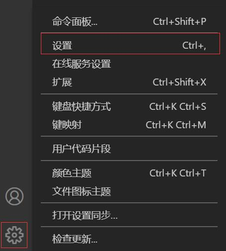
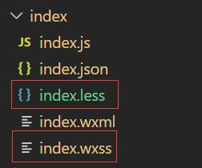

# 微信小程序原生开发，踩坑及解决方案

作者：罗永梅
时间：2021 年 01 月 20 日

### 一、微信小程序自定义 tabbar(原生 tabbar 闪烁显示)

微信小程序给出的原生 tabbar 难以满足公司产品的需求，自定义 tabbar 使用后，即调用 wx.hideTabBar()隐藏原生 tabbar 会闪烁。

解决方案：  
在 app.json 中的 tabBar 项指定 custom 字段为"true"：

```json
{
  "tabBar": {
    "custom": true
  },
```

### 二、微信小程序自定义 tabbar 兼容 iPhoneX

自定义的 tabbar 在 iPhoneX 下会被挡住一截，可以通过 css 来修改:

```css
.tabbar {
  height: 50px; // tabbar高度
}

.page-container.has-tabbar {
  padding-bottom: 50px; // 页面距离底部空出tabbar高度
}

// 兼容iPhoneX
@supports (bottom: constant(safe-area-inset-bottom)) or
  (bottom: env(safe-area-inset-bottom)) {
  .page-container.has-tabbar {
    padding-bottom: calc(
      env(safe-area-inset-bottom) + 50px
    ); // iPhoneX底部原来的高度+tabbar高度
  }
}
```

### 三、微信小程序使用 less

1. 在 vscode 里面下载插件 Easy-ess
2. 在 vscode 里面打开设置找到 Easy LESS config，在 setings.json 中编辑  
   

```json
"less.compile": {
    "outExt": ".wxss" // 输出文件的后缀,默认为.css
  }
```

这样在 wxss 同级的创建一个.less 的文件，编辑该文件并保存后，自动会生成或修改同名的.wxss 文件。



### 四、微信小程序去除 Button 边框

button 默认有边框，css 使用 border: none 去掉不可以，边框依然存在，改用 button::after{ border: none; } 来去除边框

### 五、微信开发者工具请求报错 400 (Origin domain 127.0.0.1 is not allowed)

微信开发者工具启动项目地址是 127.0.0.1，由于后端限制 127.0.0.1 不可跨域访问
解决方案：

```js
function request(method, url, data, configheader) {
  return new Promise(function (resolve, reject) {
    const token = wx.setStorageSync("token");

    const header = {
      ...configheader,
      authorization: "bearer " + token,
      // 配置请求地址，解决本地调试400 (Origin domain 127.0.0.1 is not allowed)报错
      Origin: "http://www.baidu.com",
    };

    wx.request({
      url: method === "GET" ? mergeUrl(url, data) : url,
      method,
      data: method === "GET" ? {} : data,
      header,
      success(res) {
        //请求成功
        if (res.statusCode == 200) {
          resolve(res.data);
        } else {
          reject(res);
        }
      },
      fail(err) {
        // 请求失败
        reject(err);
      },
    });
  });
}
```
