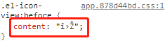
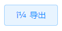

# .Vue3 + Element Plus + Vue Router4 开发，踩坑及解决方案

作者：罗永梅
时间：2021 年 06 月 24 日

### 一、Element Plus 按需引用，引入.scss 文件时，若自定义全局样式，会提示“@use rules must be written before any other rules. @use "sass:math"; ...”
原来在Element UI中的写法是可用的：
```js
module.exports = {
   css: {
    loaderOptions: {
      sass: {
        prependData: `@import "@/styles/variables.scss";`,
      },
    },
  }
};
```
改用Element Plus后，进行按需引用，引入.scss 文件时，根据官方文档提示配置babel.config.js后，会提示如下：


解决方案一：
vue.config.js
```js
module.exports = {
  css: {
    loaderOptions: {
      scss: {
        additionalData: `
          @use "@/styles/variables.scss" as *;
        `,
      },
    },
  },
};
```

解决方案二：

1.安装 sass-resources-loader
   > nnpm i sass-resources-loader

2 在 vue.config.js 中使用：

vue.config.js
```js
module.exports = {
  chainWebpack: (config) => {

    const oneOfsMap = config.module.rule("scss").oneOfs.store;
    oneOfsMap.forEach((item) => {
      item
        .use("sass-resources-loader")
        .loader("sass-resources-loader")
        .options({
          // 公共样式文件地址
          resources: ["./src/styles/variables.scss"],
        })
        .end();
    });
  },
};
```


### 二、Element Plus 生产环境字体图标出现乱码




因为使用了dart-sass的原因，似乎这个作者现在也没打算解决

解决方案：  
1.卸载dart-sass
> npm uninstall sass

2.安装node-sass
> npm install node-sass -D

2.安装node-sass
> npm install node-sass -D

3.启动项目如有提“Node Sass version 6.0.0 is incompatible with^4.0.0”需要卸载之前版本的node-sass
>npm uninstall node-sass

4.然后安装4.14.1版本
> npm install node-sass@4.14.1

重新运行，图标就正常了