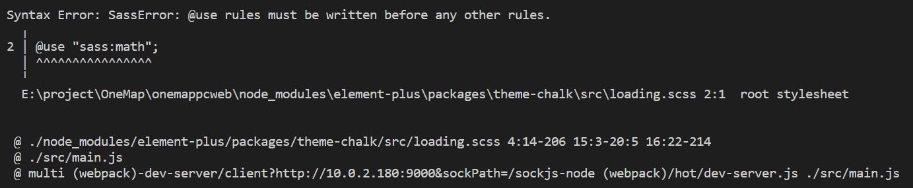

# .Vue3 + Element Plus + Vue Router4 开发，踩坑及解决方案

作者：罗永梅
时间：2021 年 06 月 24 日

### 一、Element Plus 按需引用，引入.scss 文件时，若自定义全局样式，会提示“@use rules must be written before any other rules. @use "sass:math"; ...”
原来在Element UI中的写法是可用的：
```js
module.exports = {
   css: {
    loaderOptions: {
      sass: {
        prependData: `@import "@/styles/variables.scss";`,
      },
    },
  }
};
```
改用Element Plus后，进行按需引用，引入.scss 文件时，根据官方文档提示配置babel.config.js后，会提示如下：



解决方案：

1.安装 style-resources-loader
   > npm i style-resources-loader -s

2 在 vue.config.js 中使用：

vue.config.js

```js
module.exports = {
  pluginOptions: {
    "style-resources-loader": {
      preProcessor: "sass",
      patterns: [
        path.resolve(__dirname, "./src/style/variables.scss"),
      ],
    },
  },
};
```
