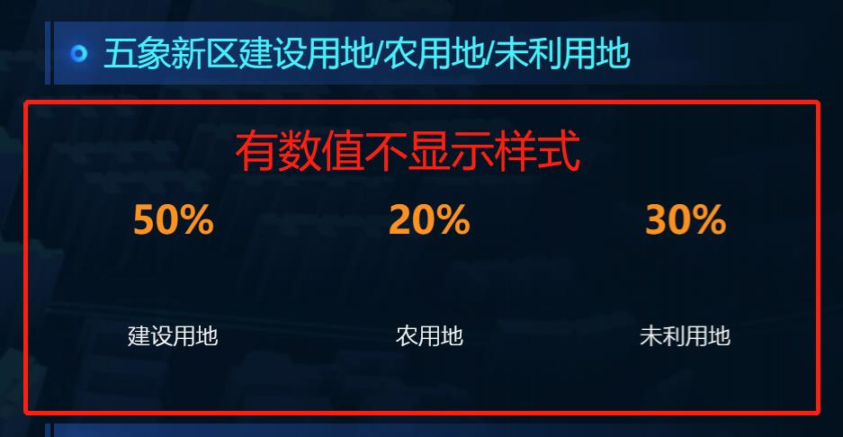
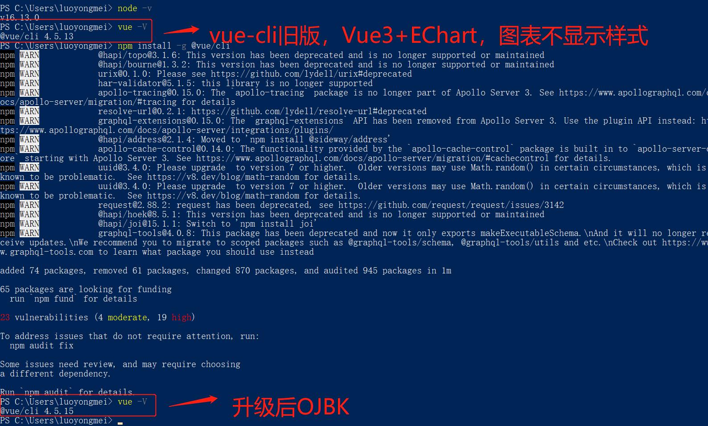
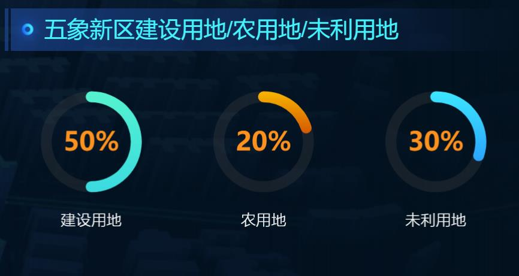
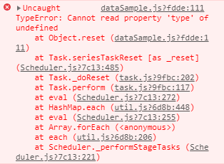

# Vue3 + EChart5.x 开发，踩坑及解决方案

作者：罗永梅
时间：2021 年 11 月 04 日

### 一、Vue3 + Echart5.x，饼图图表不显示样式

问题如下：


解决方案：
升级 vue-cli 版本


升级后显示：


### 二、Vue3 + Echart5.x，图例点击报错

Vue2 使用正常，Vue3 使用报错：


解决方案：

```js
import { ref } from "@vue/runtime-core";
import * as echarts from "echarts";

const chart = ref(null); // 改成 let chart = null; 全局变量则可以使用
chart = echarts.init(document.getElementById("test"));
```

### 三、Echart4.x 升级到 Echart5.x，浏览器警告“There is a chart instance already initialized on the dom.”

解决方案：

```js
import * as echarts from "echarts";
let chart; // 全局变量

if (chart != null && chart != "" && chart != undefined) {
  chart.dispose();
}

// 基于准备好的dom，初始化echarts实例
chart = echarts.init(document.getElementById("test"));
```
