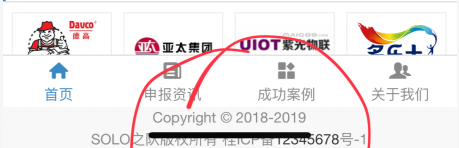
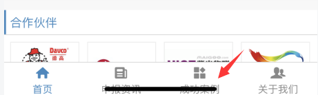
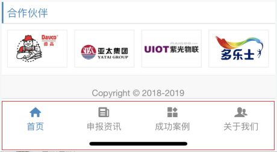

# WebApp/ 移动端开发，踩坑及解决方法

作者：罗永梅  
时间：2021 年 01 月 13 日

### 一、Rem 使用方法

详情查看 https://github.com/xLong1029/Notes/blob/master/WorkMark/Less.md

### 二、IconFont 使用方法

详情查看 https://github.com/xLong1029/Notes/blob/master/WorkMark/Css.md

### 三、取消移动端浏览器自带样式

移动端系统浏览器会自带一些样式，比如输入框、按钮等会有默认样式，需要清除这些样式才能真正显示原有设计的 css 样式：

```css
* {
  // 取消移动端浏览器自带样式
  -webkit-appearance: none;

  //这一句是用来解决在安卓上的点击出现蓝色背景问题
  -webkit-tap-highlight-color: rgba(0, 0, 0, 0);
}

// 下面是解决ios上去除微信点击蓝色背景
a:focus,
input:focus,
p:focus,
div:focus {
  -webkit-tap-highlight-color: rgba(0, 0, 0, 0);
  -webkit-user-modify: read-write-plaintext-only;
}
```

### 四、点击 A 标签，会出现光标问题

在移动端即使使用 cursor: pointer; 点击 A 标签时会显示光标可以输入文字。

解决方法（以下以 vue 为实例）是给 A 标签添加点击事件：

```html
<a class="btn fr" @click="toSearch">
  <i class="icon-search"></i>
</a>

// 点击事件 toSearch(){ gotoPage('Search', {}, this); } //
gotoPage是我写的一个通用方法 gotoPage(routeName, params, _this){
_this.$router.push({ name : routeName, query : params }); }
```

### 五、移动端访问设置

```js
    function isMobile(){
        // 如果有HTTP_X_WAP_PROFILE则一定是移动设备
        if (isset ($_SERVER['HTTP_X_WAP_PROFILE']))
            return true;

        //此条摘自TPM智能切换模板引擎，适合TPM开发
        if(isset ($_SERVER['HTTP_CLIENT']) &&'PhoneClient'==$_SERVER['HTTP_CLIENT'])
            return true;
        //如果via信息含有wap则一定是移动设备,部分服务商会屏蔽该信息
        if (isset ($_SERVER['HTTP_VIA']))
            //找不到为flase,否则为true
            return stristr($_SERVER['HTTP_VIA'], 'wap') ? true : false;
        //判断手机发送的客户端标志,兼容性有待提高
        if (isset ($_SERVER['HTTP_USER_AGENT'])) {
            $clientkeywords = array(
                'nokia','sony','ericsson','mot','samsung','htc','sgh','lg','sharp','sie-','philips','panasonic','alcatel','lenovo','iphone','ipod','blackberry','meizu','android','netfront','symbian','ucweb','windowsce','palm','operamini','operamobi','openwave','nexusone','cldc','midp','wap','mobile'
            );
            //从HTTP_USER_AGENT中查找手机浏览器的关键字
            if (preg_match("/(" . implode('|', $clientkeywords) . ")/i", strtolower($_SERVER['HTTP_USER_AGENT']))) {
                return true;
            }
        }
        //协议法，因为有可能不准确，放到最后判断
        if (isset ($_SERVER['HTTP_ACCEPT'])) {
            // 如果只支持wml并且不支持html那一定是移动设备
            // 如果支持wml和html但是wml在html之前则是移动设备
            if ((strpos($_SERVER['HTTP_ACCEPT'], 'vnd.wap.wml') !== false) && (strpos($_SERVER['HTTP_ACCEPT'], 'text/html') === false || (strpos($_SERVER['HTTP_ACCEPT'], 'vnd.wap.wml') < strpos($_SERVER['HTTP_ACCEPT'], 'text/html')))) {
                return true;
            }
        }
        return false;
    }

    //移动设备浏览，则切换模板
    if (ismobile()) {
        //设置默认默认主题为 Mobile
        $app_path='Mobile/'.CONTROLLER_NAME.'/'.ACTION_NAME;
        redirect($app_path);
    }
```

### 六、iOS 上同时使用 fixed 和 transition 进行变换时会出现空白

解决方法：transform 元素内部不能有 absolute、fixed 元素，要分离开（这里不好贴代码展示，自行理解）。

### 七、iPhoneX 底部会空出一段距离，导致设置了 fixed 的标签栏无法挡住内容

问题描述如图：



解决方案：

<meta name="viewport" content="width=device-width, initial-scale=1, maximum-scale=1, user-scalable=0, viewport-fit=cover">

viewport-fit 默认值为 auto，改成 cover 即可

### 八、iPhoneX 底部会出现一条挡住标签栏

问题描述如图：



解决方案：

```CSS
    // 解决iPhoneX底部当初标签栏的问题
    @media only screen and (device-width: 375px) and (device-height: 812px) and (-webkit-device-pixel-ratio: 3) {
        .tabbar {
            //@tabbar_h和@rem是less里我设置的一个通用变量，用来定义标签栏高度，在其基础上多加30rem;
            height: @tabbar_h + 30*@rem;
        }

    }
```

效果图：



### 九、搜索页面在 ios 上希望通过输入法键“搜索”直接触发搜索功能

解决方案：

给 input 添加 type="search"后可以使输入法弹出“回车”键。
加入 enter 事件后，点击输入法的搜索键可以直接进行搜索（只有安卓有效）：

```HTML
<input id="keyword" type="search" v-model="keyword" placeholder="请输入搜索关键词" @keyup.enter="getListData(listNum, false)"/>
```

```JS
// 获取列表内容
getListData(){
    if(this.keyword == ''){
        this.showWarnModel('请输入关键字', 'warning');
        return false;
    }
    // 这部分是api功能代码...
}
```

以上方法测试发现在 iOS 上无效，输入法无法显示“搜索”键，只有“回车”键。

解决方案：form 标签上要加 action 属性

但是加上 action 属性后会导致提交表单刷新页面，为了不刷新当前页，直接搜索，需要添加一个 iframe 并使其隐藏，让表单提交到这个隐藏页面：

```HTML
<form action="/Search" target="blankFrame">
    <iframe id="rfFrame" name="blankFrame" src="about:blank" style="display:none;"></iframe>
    <i class="icon-search search_btn" @click="getListData(listNum, true)"></i>
    <input id="keyword" type="search" v-model="keyword" placeholder="请输入搜索关键词" @keyup.enter="getListData(listNum, true)"/>
</form>
```

### 十、表单自动填充时会自带黄色背景

chrome 表单自动填充后，input 文本框的背景会变成偏黄色的，这是由于 chrome 会默认给自动填充的 input 表单加上 input:-webkit-autofill 私有属性。

解决方案：

```CSS
// 移除表单自动填充黄色背景
input:-webkit-autofill,
textarea:-webkit-autofill,
select:-webkit-autofill,
input[type="text"]:focus, input[type="password"]:focus, input[type="search"]:focus, input[type="tel"]:focus, textarea:focus
{
    // 去黄
    -webkit-box-shadow: 0 0 0 1000px white inset;
    background-color: #fff;
    background-image: none;
    // 字体颜色
    -webkit-text-fill-color: 333;
    color: #333;
}
```

### 十一、Input 使用 type="search"属性后，搜索框会显示"X"图标

解决方案：

```CSS
input[type="search"]::-webkit-search-cancel-button {
    display: none;
}
```

### 十二、微信 PC 客户端，不支持 ES6

微信 PC 客户端，不支持 ES6 特性，导致页面内如有使用该特性的部分无法显示出来

测试浏览器是否支持 ES6 特性语法，直接在浏览器中打开地址： http://ruanyf.github.io/es-checker/index.cn.html

各大转换工具、JavaScript 解析引擎对 ES6 的支持程度情况，可以参查看这个地址：http://kangax.github.io/compat-table/es6/

解决方法，引入 browser.min.js，并且在 script 标签加上 type="text/babel"：

```html
<script src="browser.min.js"></script>
<script type="text/babel">
  let value = "测试";
  alert(value);
</script>
```

browser.min.js 下载地址：https://github.com/yc880770/browser/blob/master/browser.min.js

### 十三、移动端获取后端返回的文件流转Blob对象下载，文件名和后缀名有问题

开发有个需求是：文件必须授权才能下载，那么就不能使用 get 请求去获取文件地址，需要在请求头传 token 给后端，后端再返回文件流进行下载。

前端使用 Blob 对象进行数据处理时，在 PC 端可以实现使用，但是在移动端兼容性较差，部分安卓手机自带浏览器会出现文件不识别的请客，将下载的文件进行重命名，命名名字为 window.URL.createObjectURL(blob)创建出来的地址字符串，也有的文件名会直接变成"undefine"，而且后缀名也会受影响，如部分小米手机浏览器下载文件后缀会变成.bin，部分 oppo 手机浏览器下载会变成.txt。

* 后缀名解决方案：  
1.指定文件类型
```
let blob = new Blob([data], { type: "application/pdf" });

```
可以解决后缀名的问题，目前测试图片、pdf、压缩包文件可以解决，但是特殊文件诸如 mdb、dwg 还是无解。


* 文件名+后缀名完整解决方案：   
1.请求头传 token 给后端，后端返回一个匿名的 Get 请求地址，地址改写成文件路径的形式，如（http://wwww.xlong1029.com/key/xxx.pdf）  
2.再创建 a 标签，href属性加上"http://wwww.xlong1029.com/key/xxx.pdf"，创建下载

示例代码：

```js
// 下载文件
async download(file) {
    const { id, fileName } = file;

    if (!file || !id) {
    this.$message.error("文件不存在，无法下载");
    return;
    }

    this.downLoading = true;

    try {
        const key = await Api.GetAttachmentDownloadKey(id); // 请求成功返回key

        if (key) {
            // 创建a标签
            const a = window.document.createElement("a");
            a.style.display = "none";
            // 拼接Get请求地址，例如http://wwww.xlong1029.com/key/xxx.pdf
            // 其实这个地址单独用Postman请求返回的还是文件流，但是放手机浏览器地址栏可以“骗”浏览器进行下载
            a.href = `http://wwww.xlong1029.com/${key}/${fileName}`; 
            // 设置下载名称
            a.download = fileName;
            document.body.appendChild(a);
            // 触发标签点击事件
            a.click();
            document.body.removeChild(a);
            // 释放URL
            window.URL.revokeObjectURL(url);

            this.$message.success("文件下载成功");
        } else {
            this.$message.error("文件下载失败，请稍后重试");
        }
    } catch (err) {
        this.downLoading = false;
        this.$message.error("文件获取失败，请稍后重试");
    }
}
```
亲测解决问题