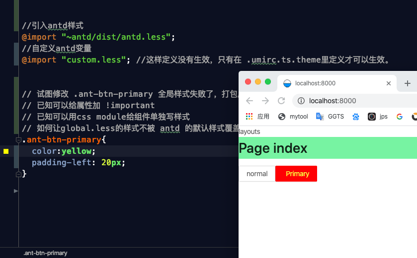
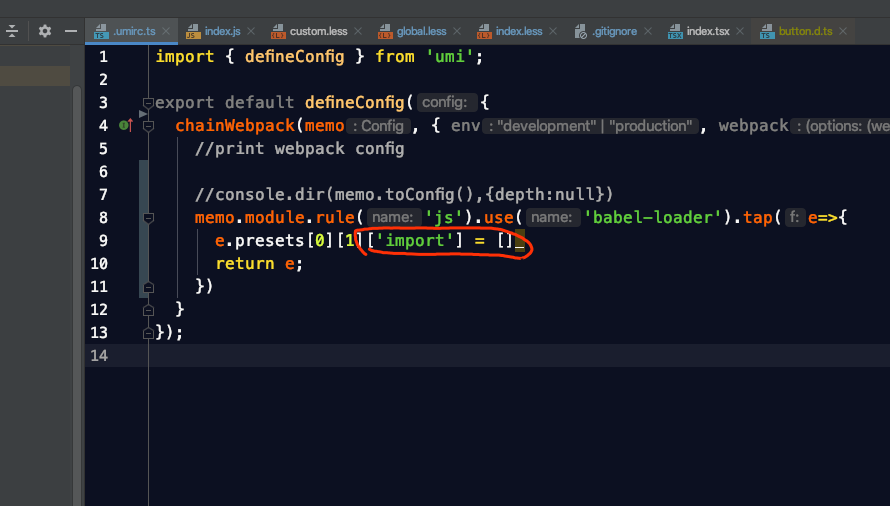
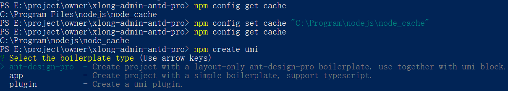

# Reat开发，踩坑及解决方法

作者：罗永梅  
时间：2020年03月13日

## Create-reat-app/ 创建antd-mobile开发

> npm install -g create-react-app   /* 安装create-react-app，建议使用cnpm */  
> create-react-app myapp            /* 使用命令创建应用，myapp为项目名称 */  
> cd myapp                          /* 进入目录，然后启动 */
> npm start

*生成项目后，脚手架为了“优雅”隐藏了所有的webpack相关的配置文件，此时查看myapp文件夹目录，会发现找不到任何webpack配置文件。执行以下命令：  

> npm run eject

可以看到完整的项目结构

## Create-reat-app/ 用sass编译出来的样式有乱码前缀
例如：原样式 .container{...}，编译后为.xxx_container{...}，导致渲染时浏览器无法显示样式

* 解决方法

在config文件夹下找到 webpack.config.dev.js 文件，在 module 中添加 /.scss$/,  
```js
module: {
    rules:[
        {
            test: /\.scss$/,
            loaders: ["style-loader","css-loader?sourceMap","sass-loader?sourceMap"],
        }
    ]
}
```

如果要在生产环境中生效，需要在webpack.config.prod.js做同样的配置。

## Create-reat-app/ 使用固定路径
遇到利用相对于根目录进行引用组件，路径多数是"../../../"不利于开发

* 解决方法

需要在webpack.config.dev.js里添加如下配置：

```js
alias: {
    // 定义别名和插件位置
    '@': path.resolve('./src'),
    'api': path.resolve('./src/api'),
    'pages': path.resolve('./src/pages'),
    'components': path.resolve('./src/components'),
    'styles': path.resolve('./src/styles'),
    'images': path.resolve('./src/images'),
    'js': path.resolve('./src/js'),
}
``` 

修改后可直接写相对路径"@/xxx/xxx"即"src/xxx/xxx"

* 在任何模块文件内部，可以使用__dirname变量获取当前模块文件所在目录的完整绝对路径

* path.resolve（）方法将一系列路径或路径段解析为绝对路径。语法：path.resolve([from ...], to)

详细用法可看：http://javascript.ruanyifeng.com/nodejs/path.html

## Create-reat-app/ 使用Browser去掉Url中的“#”

* 解决方法  

在index.js做如下修改  

```js
import { BrowserRouter } from 'react-router-dom';

ReactDOM.render((
    <BrowserRouter>
      <App />
    </BrowserRouter>
), document.getElementById('app'));
```

## Reat + Antd Design + UmiJS/ 全局修改Antd样式

UmiJS 默认使用babel + plugin + import 做按需编译，导致按需引入对应组件时已载入对应样式，无法全局强制修改
* 解决方法  

将其配置删掉





## Reat + Antd Design + UmiJS/ npm ERR: Could not install from "Files\nodejs\node_cache\_npx\5428" as it does not contain a package.json file.

使用`npm create umi`创建项目时，报错：`npm ERR: Could not install from "Files\nodejs\node_cache\_npx\5428" as it does not contain a package.json file.`  

通过`npm config get cache` 查看 npm 的 cache 路径为`C:\Program Files\nodejs\node_cache`，因包含空格所以引发程序错误。

* 解决方法

将有空格的路径改写为没有空格的：
> npm config set cache "C:\Program\nodejs\node_cache"

