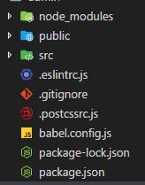

# Vue-cli3.0使用配置，踩坑及解决方法

作者：罗永梅  
时间：2018年11月1日

最近安装了下 Vue-cli3 版本。 和 Vue-cli2 相比文件目录少了很多配置，很明显的改变就是没有了build和config目录。
那么像 Vue-cli2 之前的关于端口号的配置，打包之后路径的配置，该怎么办？
官方文档提供了一个可选配置文件：vue.config.js ，如果项目的 (和 package.json 同级的) 根目录中存在这个文件，那么它会被 @vue/cli-service 自动加载。你也可以使用 package.json 中的 vue 字段，但是注意这种写法需要你严格遵照 JSON 的格式来写。之前在 Vue-cli2 里写的配置都可以写在vue.config.js文件里。

官方文档地址：https://cli.vuejs.org/guide/

### 一、安装 Vue-cli3 

Vue CLI 需要 Node.js 8.9 或更高版本 (推荐 8.11.0+)。  

在终端输入以下命令:  

> npm install -g @vue/cli  

### 二、安装完 Vue-cli3 之后，还想用 Vue-cli2.x 版本  

Vue-cli3 和旧版使用了相同的 vue 命令，所以 Vue-cli2 (vue-cli) 被覆盖了。如果你仍然需要使用旧版本的vue init 功能，你可以全局安装一个桥接工具：

> npm install -g @vue/cli-init  
> // 安装完后 就还可以使用 vue init 命令  
> vue init webpack my_project  

### 三、Vue-cli 搭建脚本文件

以搭建一个项目名称为 vue-test 的 Vue 前端项目为例  

在终端输入以下命令:  

> vue create vue-test  

### 四、根据提示进行相应配置

以手动配置为例：

  

前2个是我之前配置的默认配置，如果你是第一次用3.0版本的话，是没有前两个的，而只有最后两个，这里是
让你选的，一般选Manually select features，自己配置

  

这里你可以自由选择用哪些配置，按上下键  
选择哪一个，按空格键确定，所有的都选择好后，按enter键进行下一步

  

上面选项解释：  
CSS 预处理语言: Less  
自动化代码格式化检测： Basic  
启用保存的时候使用lint检测：Lint on save  
配置文件放单独文件里： In dedicated config files

  

以上配置完就开始创建项目了


### 五、vue.config.js 配置

3.0的目录结构：

  

和 Vue-cli2 相比文件目录少了很多配置，没有了build和config目录，如果需要进行webpack配置，可以在根目录下新建一个vue.config.js文件，之前在 Vue-cli2 里写的配置都可以写在这里。

vue.config.js 相关配置请参考： https://github.com/vuejs/vue-cli/tree/dev/docs/config

### 六、vue.config.js 完整的默认配置

```html
module.exports = {
	// 部署应用程序的基本URL
	baseUrl: '/',
	// 输出文件目录
	outputDir: 'dist',
	// 用于嵌套生成的静态资产（js，css，img，fonts）的目录。
	// assetsDir: '',
	// 以多页模式构建应用程序。
	pages: undefined,
	// 是否开启eslint保存检测
	lintOnSave: true,
	// 是否使用包含运行时编译器的Vue核心的构建。
	runtimeCompiler: false,
	// 默认情况下babel-loader忽略其中的所有文件node_modules。
	transpileDependencies: [],
	// 生产环境是否生成 sourceMap 文件
	productionSourceMap: true,
	// webpack配置
	configureWebpack: () => {},
	// webpack链接API，用于生成和修改webapck配置
	chainWebpack: () => {},
	// css相关配置
	css: {
		// 是否启用 CSS modules 将所有*.(css|scss|sass|less|styl(us)?)文件视为CSS模块
		modules: false,
		// 是否使用css分离插件
		extract: true,
		// 是否在构建样式地图
		sourceMap: false,
		// css预设器配置项
		loaderOptions: {},
	 },
	 // webpack-dev-server 相关配置
	 devServer: {
		 host: '0.0.0.0',
		 port: 8080,
		 https: false,
		 hotOnly: false,
		 proxy: null, // 设置代理
		 before: app => {}
	},
	// 是否用 thread-loader 来完成 Babel 或 TypeScript 转换，当系统具有多于1个CPU核心时，才启用此功能
	parallel: require('os').cpus().length > 1,
	// PWA 插件相关配置
	pwa: {},
	// 第三方插件配置
	pluginOptions: {}
}
```

### 七、import 样式不加载问题

在开发项目过程中，我有使用到 vant 的移动端框架，按官方文档方法导入所有组件：

```html
import Vue from 'vue';
import Vant from 'vant';
import 'vant/lib/vant-css/index.css';

Vue.use(Vant);
```

但是运行项目后，发现样式并没有加载，导致页面混乱无法。  
解决方法：修改 vue.config.js 的配置，将 modules 设置为 false

```html
module.exports = {
	...
	// css相关配置
    css: {
        // 设置为true会导致import css 模块时样式无法加载
        modules: false,
    },
	...
}
```


