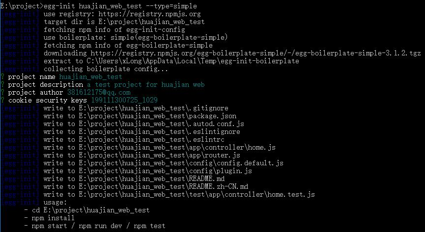

# Egg.js + nunjucks模板渲染

作者：罗永梅  
时间：2019年02月12日

Egg.js官方文档地址：https://eggjs.org/zh-cn/intro/index.html

### 一、安装egg

egg 需要 Node.js 8.x以上版本。  

在终端输入以下命令全局安装egg:  
> npm i egg-init -g 

初始化项目： 
> egg-init 项目名称 --type=simple

安装依赖：
> cd 项目路径  
> npm install  

启动项目：  
> npm run dev / egg-bin dev

例子：



### 三、目录结构 

完整的目录结构：https://eggjs.org/zh-cn/basics/structure.html

### 四、模板渲染
安装对应的插件 egg-view-nunjucks：  
> npm i egg-view-nunjucks --save

开启插件： 

在config/plugin.js文件中添加： 
```
exports.nunjucks = {
  enable: true,
  package: 'egg-view-nunjucks'
};
```

在config/config.default.js文件中添加： 
```
exports.keys = <此处改为你自己的 Cookie 安全字符串>;
// 添加 view 配置
exports.view = {
  defaultViewEngine: 'nunjucks',
  mapping: {
    '.tpl': 'nunjucks',
  },
};
```

nunjucks模板官方文档：https://nunjucks.bootcss.com/templating.html

### 五、使用Less编译(可选)
vscode安装less插件：https://marketplace.visualstudio.com/items?itemName=mrcrowl.easy-less

本地项目.vscode的settings.json文件中添加如下配置：
```
{    
    "less.compile": {
        "compress":  true,  // true => remove surplus whitespace
        "sourceMap": false,  // true => generate source maps (.css.map files)
        "out": "..\\css\\",
        "autoprefixer": "> 5%, last 2 Chrome versions, not ie 6-9"
    }
}
```
添加完成后，每次保存.less文件都会在对应的css文件夹中自动生成.css文件
例如：less/styles.less -> css/styles.css