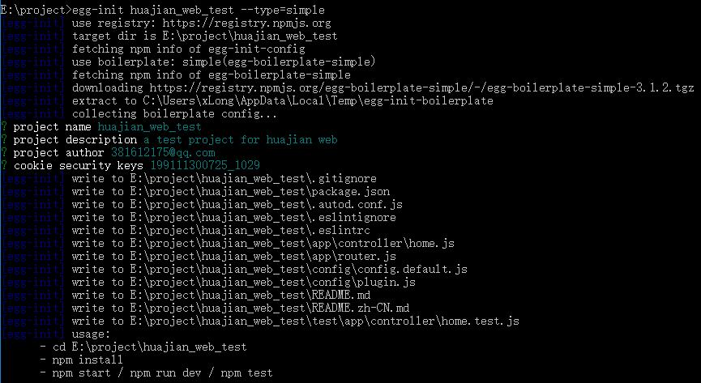
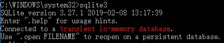
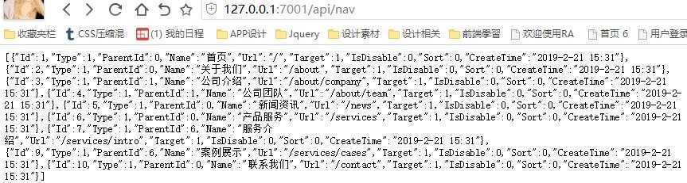

# 基于 Egg.js + Nunjucks + SQLite 开发入门、踩坑及解决方法

作者：罗永梅
时间：2019 年 02 月 22 日

Egg.js 官方文档地址：https://eggjs.org/zh-cn/intro/index.html

### 一、安装 egg

egg 需要 Node.js 8.x 以上版本

在终端输入以下命令全局安装 egg:

> npm i egg-init -g

初始化项目：

> egg-init 项目名称 --type=simple

安装依赖：

> cd 项目路径  
> npm install

启动项目：

> npm run dev / egg-bin dev

例子：


### 三、目录结构

完整的目录结构：https://eggjs.org/zh-cn/basics/structure.html

### 四、Nunjucks 模板渲染

nunjucks 模板官方文档：https://nunjucks.bootcss.com/templating.html

为了便于开发，可在 vscode 中安装对应的插件：
Nunjucks Visual Studio Code Extension Pack：https://marketplace.visualstudio.com/items?itemName=douglaszaltron.nunjucks-vscode-extensionpack

1. 安装对应的插件 egg-view-nunjucks

> npm i egg-view-nunjucks --save

2. 使用 egg-view-nunjucks 插件  

在 config/plugin.js 文件中添加：

```
// 开启插件
exports.nunjucks = {
  enable: true,
  package: 'egg-view-nunjucks'
};
```

在 config/config.default.js 文件中添加：

```
exports.keys = <此处改为你自己的 Cookie 安全字符串>;
// 添加 view 配置
exports.view = {
  defaultViewEngine: 'nunjucks',
  mapping: {
    '.html': 'nunjucks',
  },
};
```
3. 使用模板渲染

添加Controller 和 Router:

app/controller/home.js

```
const Controller = require('egg').Controller;

class HomeController extends Controller {
  async index() {
    const data = { text: 'hello egg.js' }
    await this.ctx.render('home/index.html', {});
  }
}

module.exports = HomeController;
```

app/router.js

```
module.exports = app => {
  const { router, controller } = app;
  router.get('/', controller.home.index);
};
```

编写模板文件，一般放置在 app/view 目录下:

app/view/home/index.html

```
<html>
  <head>
    <title>测试</title>
    <link rel="stylesheet" href="/public/css/index.css" />
  </head>
  <body>
    <div>
      {{ text }}
    </div>
  </body>
</html>
```
启动浏览器，访问 http://localhost:7001/ 即可看到渲染后的页面

### 五、使用 SQLite
SQLite 轻型数据库，是一个软件库，实现了自给自足的、无服务器的、零配置的、事务性的 SQL 数据库引擎

1. 安装 SQLite
下载地址：https://www.sqlite.org/download.html

下载文件并解压到 C:\sqlite ：
sqlite-dll-win64-x64-3270100.zip
sqlite-tools-win32-x86-3270100.zip

添加 C:\sqlite\sqlite-tools-win32-x86-3270100 到 PATH 环境变量

最后在命令提示符下，使用 sqlite3 命令查看安装版本：


2. 使用可视化工具（可选）
Navicat for SQLite （14 天全功能免费）
下载地址：https://www.navicat.com.cn/download/navicat-for-sqlite

3. 项目安装 sqlite 驱动模块：

> npm install --save sqlite3

4. 建立数据库连接并获取数据

app/service/home.js

```
const Service = require('egg').Service;
const sqlite3 = require('sqlite3').verbose();

// 连接数据库
const db = new sqlite3.Database('./app/database/huajian.db', (err) => {
    if (err) {
        console.log('无法连接数据库:', err);
    }
    else{
        console.log('数据库连接成功');
    }
});

class HomeService extends Service {
    async find() {
        return new Promise((resolve,reject) => {
            // 查询内容        
            db.all("select * from T_NAVIGATION", (err,row) => {
                if(err) {
                    console.log(err);
                    reject(err);
                }
                else{
                    // console.log(JSON.stringify(row));
                    return resolve(row);
                }
            })
		})
    }
}

module.exports = HomeService;
```

启动浏览器，访问 http://localhost:7001/nav 即可看到序列化后的数据


5. 部分sql 语句

```
//增
var sql1 = db.prepare("insert into 表名 values (内容，跟mysql一样)");
sql1.run();
//console.log(sql1);//可以这样检查

//删
var sql2 = db.prepare("delete from 表名 where id = 1");
// console.log(sql2);
sql2.run();

//改
var sql3 = db.prepare("update 表名 set name = winston where id = 1");
sql3.run();

//查
//查一个表的所有数据
db.all("select * from 表名",function(err,row){
    console.log(JSON.stringify(row));
})
//查一条数据
db().each("select * from 表名",function(err,row){
    console.log(row);
})
```

### 六、使用 Sequelize(可选)
Sequelize类是引用sequlize模块后获取一个顶级对象，我们通过它来创建sequlize实例，也可以通过该对象来获取模内其它对象的引用，如：Utils工具类、Transaction事务类等。创建实例后，可以通过实例来创建或定义Model（模型）、执行查询、同步数据库结构等操作

1. 项目安装 sequelize 模块：

> npm install --save sequelize

2. 建立数据库连接

app/model/db.js

```
const Sequelize = require('sequelize');

// 连接数据库
const sequelize = new Sequelize('huajian', null ,null, {
    dialect: 'sqlite',
    storage: './app/database/huajian.db'
});

// 检验连接结果
sequelize.authenticate().then(function() {
    console.log('数据库连接成功.')
}).catch(function(err) {
    console.error('无法连接数据库:', err)
});

module.exports = sequelize;
```

3. 定义Model

app/model/HomeNav.js

```
const Sequelize = require('sequelize');
const sequelize = require('./db');

const Navgation = sequelize.define('T_Navigation', {
    Id: {
        type: Sequelize.INTEGER,
        primaryKey: true,
        allowNull: false
    },
    Type: {
        type: Sequelize.INTEGER,
        allowNull: false
    },
    ParentId: {
        type: Sequelize.INTEGER,
        allowNull: false
    },
    Name: Sequelize.TEXT(500),
    Url: Sequelize.TEXT(500),        
    Target: {
        type: Sequelize.INTEGER,
        allowNull: false
    },
    IsDisable: {
        type: Sequelize.INTEGER,
        allowNull: false
    },
    Sort: {
        type: Sequelize.INTEGER,
        allowNull: false
    },
    CreateTime: Sequelize.TEXT,
    
},{
    //使用自定义表名
    freezeTableName: true,
    //去掉默认的添加时间和更新时间
    timestamps: false
});

module.exports = Navgation;
```

4. 获取数据

app/service/home.js
```
const Service = require('egg').Service;
const db = require('../model/HomeNav');

class HomeService extends Service {
    async find() {
        // 查询内容
        const res =  db.findAll().then(res => {
            return res;
        }).catch(err => {
            console.log('查询失败', err.message);
        });
        
        return res;
        
    }
}

module.exports = HomeService;
```
启动浏览器，访问 http://localhost:7001/nav 即可看到序列化后的数据

### 七、使用 Less 编译(可选)

vscode 安装 less 插件：https://marketplace.visualstudio.com/items?itemName=mrcrowl.easy-less

本地项目.vscode 的 settings.json 文件中添加如下配置：

```
{
    "less.compile": {
        "compress":  true,  // true => remove surplus whitespace
        "sourceMap": false,  // true => generate source maps (.css.map files)
        "out": "..\\css\\",
        "autoprefixer": "> 5%, last 2 Chrome versions, not ie 6-9"
    }
}
```

添加完成后，每次保存.less 文件都会在对应的 css 文件夹中自动生成.css 文件
例如：less/styles.less -> css/styles.css

### 八、项目中遇到的问题及解决方案
1. 修改开发环境端口

在 config/config.local.js(没有就新建一个) 中添加: 
```
// 开发环境配置
exports.cluster = {
    listen: {
        port: 6060,
        hostname: '127.0.0.1'
    }
}
```

2. Egg.js 中的 nunjucks 配置为自动转义，无法显示富文本数据

解决方法：  
将内容输出加上 safe 过滤器 ：{{ content }} 改成 {{ content| safe }}，表示内容是安全的不需要进行转义

3. 解决 sqllite 的{ Error: SQLITE_CANTOPEN: unable to open database file errno: 14, code: 'SQLITE_CANTOPEN' }错误

解决方法：  
1.数据库是自动建立的，不需要先建好数据库  
2.如果已有数据库，将数据库路径改成绝对路径，例如：new sqlite3.Database('./app/database/huajian.db');  
3.将包含 xx.db 的文件夹改成可读写（去掉只读）

4. 尝试使用 egg-model 和 egg-sequelize 插件失败

原因: 
1.egg-model 中的方法只针对sql，例如 now() 是sqlite中没有的，所以无法使用该插件
2.egg-sequelize 必须配合mysql，使用对sqlite也也是没用的

5. SQLite3是无时间类型，如何实现默认时间为当前时间列

方法：
```
create table log(
    content varchar(256),
    logtime TIMESTAMP default (datetime('now', 'localtime'))
)
```
可视化工具中可以在默认值中直接输入 (datetime('now', 'localtime')))

6. Node.js 中使用 ES6 中的 import / export 的方法

网上各种方法都尝试了，都不好用。建议还是放弃使用 ES6，使用 Node中的 module 模块语法

在app/x/x.js中写方法
```
module.exports = {
    a(){
        console.log('a');
    },
    b(){
        console.log('b');
    }
}
```

在app/y/y.js中使用
```
const fx = require("../x/x");

fx.a();
fx.b();
```

7. Egg.js 跨域 post失败提示{ message: 'invalid csrf token' } 或者：{ message: 'csrf missing' }

解决方法：  
在config/config.default.js中添加配置：  
```
config.security = {
    csrf: {
        headerName: 'x-csrf-token', // 通过 header 传递 CSRF token 的默认字段为 x-csrf-token
    }
};
```

axios请求头部设置：
```
headers: {
    'x-csrf-token':GetCookie('csrfToken')
};
```

但有个问题就是第一次请求的时候，cookie中是不存在csrfToken的，会导致请求失败，所以最好的方法是在开发环境关闭csrf验证, 需要使用egg-cors插件： 

安装依赖：  
> npm i egg-cors --save

在config/config.default.js中添加配置： 
```
config.security = {
        csrf: {
            enable: false,
            ignoreJSON: true, // 默认为 false，当设置为 true 时，将会放过所有 content-type 为 `application/json` 的请求
        },
        domainWhiteList: ['http://localhost:3001'] // 可访问的白名单地址，全部可访问则改成：['*']
    };
    config.cors = {
        allowMethods: 'GET,HEAD,PUT,POST,DELETE,PATCH,OPTIONS',
};
```

使用插件，在plugin.js中添加
```
exports.cors = {
    enable: true,
    package: 'egg-cors',
};
```

8. Egg.js项目中 跨域后 cookie 获取不到或者失效
解决方法：  
在 Getcookie 和 Delcookie 方法中添加path属性，指定cookie的ptah，例如： 
```
document.cookie = `${cname} = null; expires=Thu, 01 Jan 1970 00:00:00 GMT; path=/`;
```

