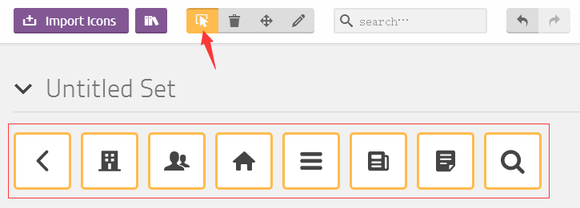
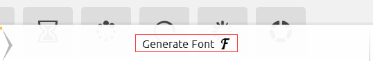
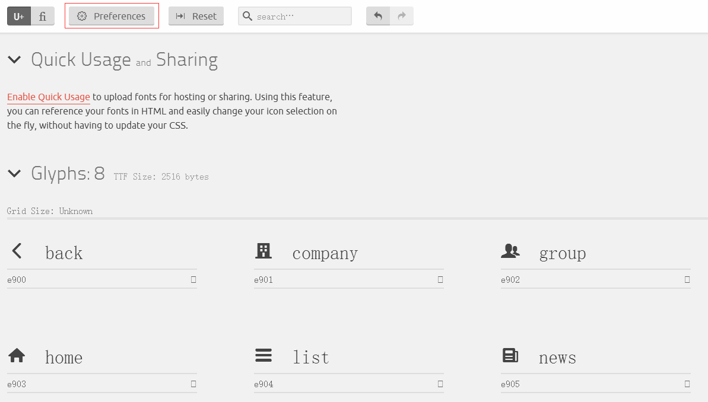
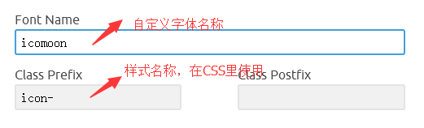
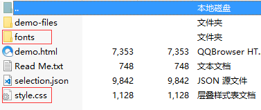
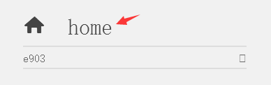

## Css&IconFont/ 如何在项目中使用字体图标

* 获取/绘制SVG图标

    一种可缩放矢量图形，SVG文件比那些GIF和JPEG格式的文件要小很多，样式中可以通过color属性直接修改图标显示颜色，方便移动端开发。
     
     
    SVG图标可到网上直接下载，推荐网址：
     
    阿里云图标：http://www.iconfont.cn/
     
    熊猫图标：https://www.easyicon.net/
     
     
    没有满意的图标就自己用设计软件绘制啦，最后导出保存成svg格式即可

* 制作成字体包

    使用 IcoMoon 可以在线生成字体包，地址：https://icomoon.io/app/#/select
    
     
    1.打开选择 Import Icons  
    
     

     
    2.勾选需要的生成字体的图标

      

     
    3.点击 Generate Font 生成字体包

     

     
    4.字体生成后，可以选择 Preference 进行一些属性设置

     
     

     
    5.一切设置好后，直接 Download 就行啦

     
     

* 在项目中使用字体图标

    1.下载的文件，我们只需要 fonts 文件夹和 style.css

     

     
    2.将这2个文件放如到项目的资源管理文件中，我的vue项目是直接放assets里了

     

     
    3.在页面中引用css
     
    普通index.html里是这样引用:

    <pre> &lt;link rel="stylesheet" href="../css/style.css"&gt; </pre>

    vue里我是直接在main.js里引用:

    <pre> require('./assets/iconfonts/style.css'); </pre>

     
    4.在需要使用图标的页面/组件中，直接加入对应的标签class属性即可
    <pre> &lt;i class="icon-home"&gt;&lt;/i&gt;  </pre>

    如果图标太多不记得属性名，可以到原来下载的zip文件中，找到demo.html，打开即可看到class属性名啦，其中前缀“icon-”这个是之前在 Preference 里设置的，未设置默认都是“icon-”前缀  
    
     