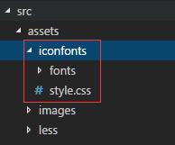

## Css&Iconfont/ 如何在项目中使用字体图标

### 一、使用Iconfont的好处

- Iconfont主要由SVG文件制成，SVG是一种可缩放矢量图形，SVG文件比那些GIF、JPEG、PNG格式的文件要小很多。
- 使用Iconfont代替传统图标，在css中可以通过color属性随意修改图标颜色，通过font-szie属性随意修改图标大小，还可以添加一些视觉效果如：阴影、旋转、透明度。在移动端开发中使用可以大大减少图片存储空间。
- 弊端：Iconfont只支持单一颜色修改，如果是需要图标颜色丰富还是得用GIF和JPEG格式等原始图片格式。

### 二、取/绘制SVG图标

SVG图标可到网上直接下载，推荐网址:

阿里云图标：http://www.Iconfont.cn/
熊猫图标：https://www.easyicon.net/

没有满意的图标就自己用设计软件绘制啦，最后导出保存成svg格式即可（绘制过程不好演示，请自学）。

### 三、制作成字体包

使用 IcoMoon 可以在线生成字体包，地址：https://icomoon.io/app/#/select

1.打开选择 Import Icons


2.勾选需要的生成字体的图标


3.点击 Generate Font 生成字体包


4.字体生成后，可以选择 Preference 进行一些属性设置


5.一切设置好后，直接 Download 就行啦


### 四、在项目中使用字体图标

1.下载的文件，我们只需要 fonts 文件夹和 style.css


2.将这2个文件放如到项目的资源管理文件中，我的vue项目是直接放assets里了




3.在页面中引用css


普通index.html里是这样引用:

```html
    <link rel="stylesheet" href="../css/style.css"/>
```

vue里我是直接在main.js里引用:
```js
    require('./assets/iconfonts/style.css');
```
4.在需要使用图标的页面/组件中，直接加入对应的标签class属性即可

```html
    <i class="icon-home"></i>
```

如果图标太多不记得属性名，可以到原来下载的zip文件中，找到demo.html，打开即可看到class属性名啦，其中前缀“icon-”这个是之前在 Preference 里设置的，未设置默认都是“icon-”前缀

