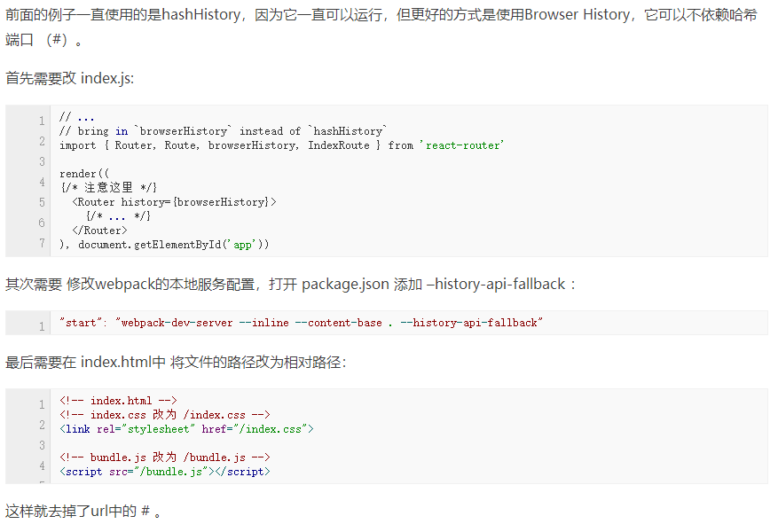

## Create-reat-app/ 创建antd-mobile开发
<pre>
 npm install -g create-react-app   /* 安装create-react-app，建议使用cnpm */  
 create-react-app myapp            /* 使用命令创建应用，myapp为项目名称 */  
 cd myapp                          /* 进入目录，然后启动 */
 npm start
</pre>

*生成项目后，脚手架为了“优雅”隐藏了所有的webpack相关的配置文件，此时查看myapp文件夹目录，会发现找不到任何webpack配置文件。执行以下命令：  

<pre>npm run eject</pre>

可以看到完整的项目结构

## Create-reat-app/ 用sass编译出来的样式有乱码前缀
例如：原样式 .container{...}，编译后为.xxx_container{...}，导致渲染时浏览器无法显示样式

* 解决方法

在config文件夹下找到 webpack.config.dev.js 文件，在 module 中添加 /.scss$/,  
<pre>
module: {
    rules:[
        {
            test: /\.scss$/,
            loaders: ["style-loader","css-loader?sourceMap","sass-loader?sourceMap"],
        }
    ]
}
</pre>

如果要在生产环境中生效，需要在webpack.config.prod.js做同样的配置。

## Create-reat-app/ 使用固定路径
遇到利用相对于根目录进行引用组件，路径多数是"../../../"不利于开发

* 解决方法

需要在webpack.config.dev.js里添加如下配置：  
<pre>
alias: {
    // 定义别名和插件位置
    '@': path.resolve('./src'),
    'api': path.resolve('./src/api'),
    'pages': path.resolve('./src/pages'),
    'components': path.resolve('./src/components'),
    'styles': path.resolve('./src/styles'),
    'images': path.resolve('./src/images'),
    'js': path.resolve('./src/js'),
}
</pre> 

修改后可直接写相对路径"@/xxx/xxx"即"src/xxx/xxx"

*在任何模块文件内部，可以使用__dirname变量获取当前模块文件所在目录的完整绝对路径。
*path.resolve（）方法将一系列路径或路径段解析为绝对路径。语法：path.resolve([from ...], to)，详细用法可看：http://javascript.ruanyifeng.com/nodejs/path.html

## Create-reat-app/ 使用Browser去掉Url中的“#”
* 解决方法  
  

*在react-router 4将Browser History改为BrowserRouter