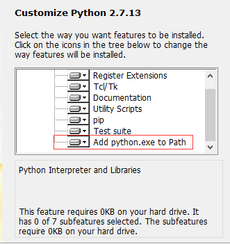
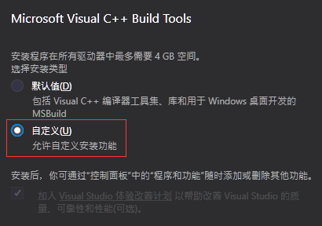
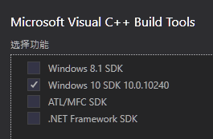

## Sass&Webpack/ 项目中npm install时遇到安装Sass依赖时可能出现的问题

* 报错如下
<pre>
 node-sass@4.7.2 install E:\project\xlong-test-vue\node_modules\node-sass  
 node scripts/install.js  
 
 gyp verb ensuring that file exists: C:\Python27\python.exe  
 gyp ERR! configure error  
 gyp ERR! stack Error: Can't find Python executable "python", you can set the PYTHON env variable.  
 gyp ERR! stack     at PythonFinder.failNoPython (E:\project\xlong-test-vue\node_modules\node-gyp\lib\configure.js:483:19)  
 gyp ERR! stack     at PythonFinder.<anonymous (E:\project\xlong-test-vue\node_modules\node-gyp\lib\configure.js:508:16)  
 gyp ERR! stack     at E:\project\xlong-test-vue\node_modules\graceful-fs\polyfills.js:284:29  
 gyp ERR! stack     at FSReqWrap.oncomplete (fs.js:152:21)  
 gyp ERR! System Windows_NT 10.0.10240  
 
 npm ERR! node-sass@4.7.2 postinstall: `node scripts/build.js`  
 npm ERR! Exit status 1  
 npm ERR!  
 npm ERR! Failed at the node-sass@4.7.2 postinstall script.  
</pre>

<b>解决方法</b>  

下载 Python2.7，安装时，勾选将 Add Python.exe to PATH，即添加至环境变量，直至安装完毕  
  

* 报错如下  
<pre>
 gyp info spawn C:\Windows\Microsoft.NET\Framework\v4.0.30319\msbuild.exe  
 gyp info spawn args [ 'build/binding.sln',  
 gyp info spawn args   '/nologo',  
 gyp info spawn args   '/p:Configuration=Release;Platform=x64' ]  
 在此解决方案中一次生成一个项目。若要启用并行生成，请添加“/m”开关。  
 生成启动时间为 2018/2/2 11:23:24。  
 MSBUILD : error MSB4132: 无法识别工具版本“2.0”。可用的工具版本为 "4.0"。  
 
 生成失败。  
 
   MSBUILD : error MSB4132: 无法识别工具版本“2.0”。可用的工具版本为 "4.0"。  
 
     0 个警告  
     1 个错误
</pre>  

<b>解决方法</b>   

下载 Visual C++ 2015 Build Tools，安装时，选择自定义安装  
  

勾选系统版本对应的Windows SDKs ，直至安装完毕  
  

在报错项目内执行 npm config set msvs_version 2015 --global 进行安装项目依赖

