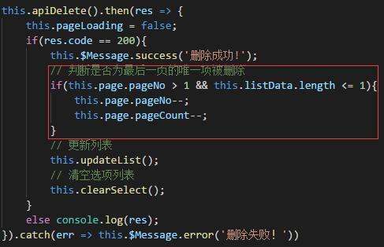

## Vue/ node（npm）配置vue时出现 vue不是内部或外部命令
* 解决方法

网上有很多资料，主要是环境Path问题，但有时需要重启电脑。  
不用重启的方法：用Everything这个软件搜索vue.cmd的位置，搜索到这个批处理文件后把这个文件的路径加入环境变量Path中  
重新启动cmd执行 vue -V 看到说明就是成功了

## Vue/ 列表页，如果删除了该列表最后一页的唯一项后，更新列表页获取列表页有误
例如：当前列表页总共有3页，最后一页即第三页只有唯一一个数据，删除该数据后，应更新列表页，获取得到2页，但由于当前页码没改变，所以还是传递第3页的参数给后端，所以后端会返回无法获取到第三页。

* 解决方法  
  

删除最后一项后，传递上一页的参数给后端，重新获取数据

## Vue/ 新版vue本地只能通过localhost访问项目，无法通过IP地址访问
* 解决方法  

在conifg文件夹下找到index.js，将 host: 'localhost' 改成 host: '0.0.0.0' ，重新run dev即可